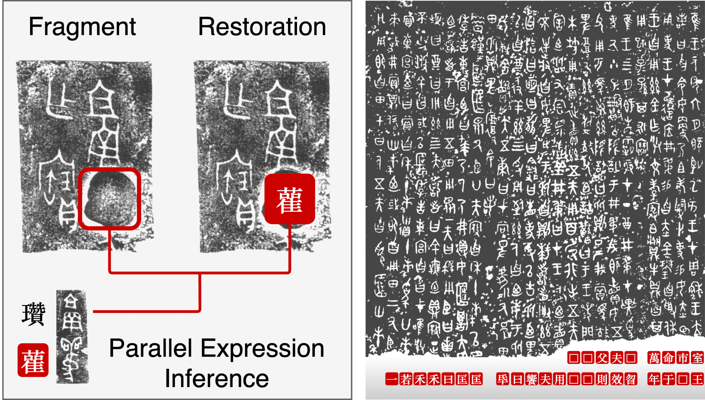
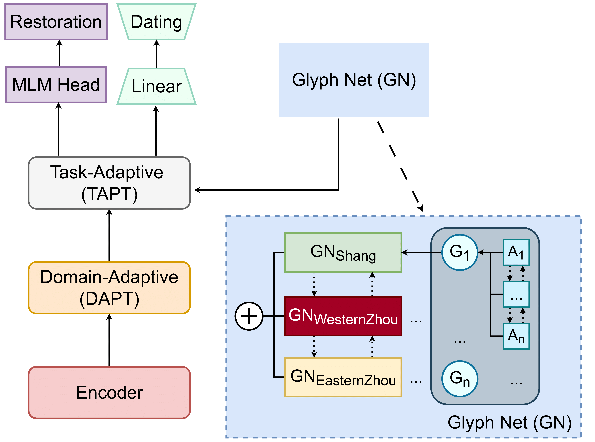

# BIRD: Bronze Inscription Restoration and Dating  

> 《詩·商頌·玄鳥》：天命玄鳥，降而生商  
> *“Heaven commissioned the swallow, to descend and give birth to Shang.”*  
> — translated by James Legge

[](https://huggingface.co/wjhuah/SikuRoBERTa_Bronze)
[](https://huggingface.co/datasets/wjhuah/BIRD)

---

## Overview

Bronze inscriptions from early China are often fragmentary and difficult to date.
We introduce **BIRD** (**B**ronze **I**nscription **R**estoration and **D**ating),
a fully encoded dataset and modeling framework grounded in standard scholarly
transcriptions and chronological labels.

BIRD formulates restoration as an **allograph-aware masked language modeling**
problem and integrates domain-adaptive pretraining (DAPT), task-adaptive
pretraining (TAPT), and a **Glyph Net (GN)** that links graphemes with their
allographs. Experiments show consistent gains in both restoration and
chronological dating.

<p align="center">
  
</p>

> **From epigrapher to MLM.**  
> The expert workflow of identifying damaged fragments, inferring from parallel
> expressions, and proposing restorations naturally mirrors a masked language
> modeling setup.

<p align="center">
  
</p>

> **BIRD pipeline.**  
> DAPT and TAPT are combined with a Glyph Net to inject allograph-level structure
> into a BERT/RoBERTa backbone, supporting both restoration and dating.

## Repository Structure

```text
.
├── main.py            # experimental pipeline
├── data/              # input data and glyphnet
├── results/           # model evaluation outputs
├── errors/            # mis-predictions
├── UNK/               # unknown glyphs
├── figure/            
├── README.md
└── LICENSE
````
---

## Citation

If you find this useful, please cite our paper:

```bibtex
@inproceedings{hua2025bird,
  title     = {BIRD: Bronze Inscription Restoration and Dating},
  author    = {Hua, Wenjie and Nguyen, Hoang H. and Ge, Gangyan},
  booktitle = {Proceedings of the 2025 Conference on Empirical Methods in Natural Language Processing},
  year      = {2025},
  publisher = {Association for Computational Linguistics}
}
